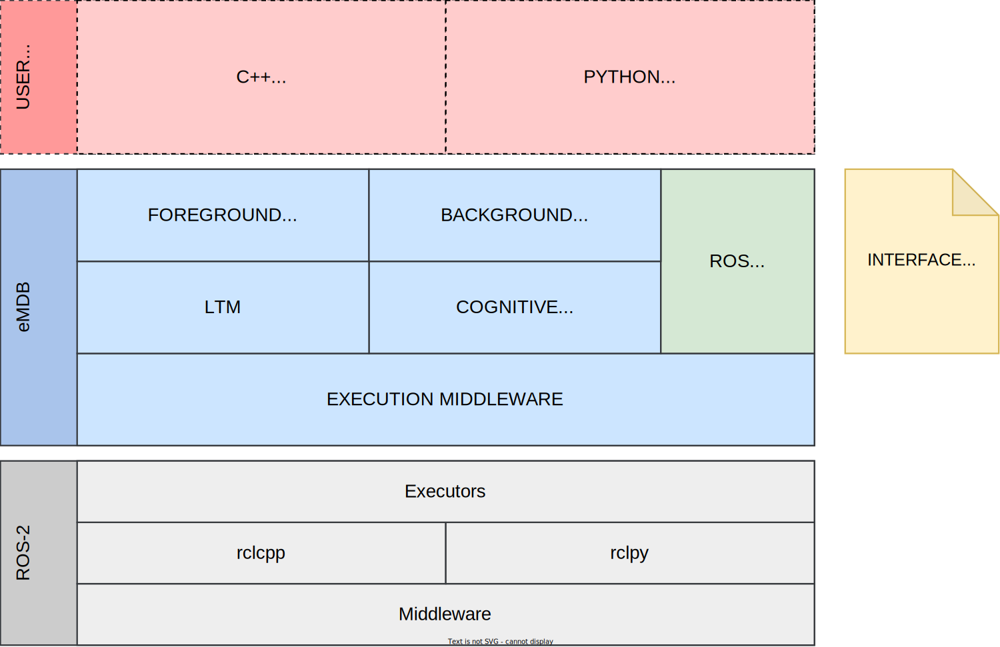

# e-MDB Core components
This is the repository that contains the packages that form the core of the software implementation of the e-MDB cognitive architecture developed under the [PILLAR Robots project](https://pillar-robots.eu/).
## Table of Contents

- **[Design](#design)**
- **[Dependencies](#dependencies)**
- **[Installation](#installation)**
- **[Configurate an experiment](#configurate-an-experiment)**
- **[Execution](#execution)**
- **[Results](#results)**

## Design



In this simplified static view, we can see the main software layers that define how software developments should be organized. The following abstraction layers are considered:

- ROS2 middleware. This cognitive architecture relies on ROS2 as the development framework for the communications and the process execution model.
- Execution middleware. Abstraction layer for managing the execution of cognitive nodes on different threads and computers.
- Long-term memory (LTM) and cognitive nodes. The LTM component is responsible for keeping a record of the specific cognitive nodes that are currently available, organized by their type. This layer also contains the different types of cognitive nodes.
- Cognitive processes. This is the layer designed for the implementation of particular cognitive processes, which use the cognitive nodes currently registered in the LTM.
- ROS interfaces. This is not an actual layer but indicates the need to include in each layer well-defined and documented interfaces that abstract access (local or remote) to the specific components included in the architecture, particularly cognitive nodes and cognitive processes.



In this figure we can see a more detailed view of the design of the core of the architecture:

- Execution nodes. They are responsible for executing the cognitive nodes in a configurable single-thread or multi-thread fashion using some load balancing strategy.
- Commander node. A client component cannot directly manage the execution nodes. Instead, it interacts with the Commander node façade through its ROS2 interface (services and topics).
- Cognitive nodes. The architecture must necessarily include at least one package with an implementation of specific cognitive nodes of the cognitive mechanism: perceptions, policies, needs, goals, etc. The current reference implementation is in the [emdb_cognitive_nodes_gii repository](https://github.com/GII/emdb_cognitive_nodes_gii), but it is possible to replace it with another one that fulfill the same interface.
- Cognitive processes. The current reference implementation is in the [emdb_cognitive_processes_gii repository](https://github.com/GII/emdb_cognitive_processes_gii). Right now, there is only one process, the Main Cognitive Loop. This process handles the classical e-MDB loop: reading perceptions, calculation of activations (determining relevant contexts), selecting policies, and executing policies.

This repository is dedicated to store the execution middleware (commander node + execution node) and the long-term memory development. There are 3 ROS 2 packages:

- _core_. Implementation for the commander node, the execution node, the long-term memory, and the base implementation for all the cognitive nodes. 
- _core_interfaces_. Needed services and messages definitions.
- _dummny_nodes_. Minimum implementation for each cognitive node. The idea is to have cognitive nodes as barebones as possible to run experiments where we only want to focus on a specific cognitive node variation / algorithm. In these cases, we want to reduce the remaining part of the cognitive architecture to a minimum functional set of elements, to avoid interferences when studying a specific change in a given cognitive node.

## Dependencies

These are the dependencies required to use this repository of the e-MDB cognitive architecture software:

- ROS 2 Humble
- Numpy 1.24.3
  
Other versions could work, but the indicated ones have proven to be functional.

## Installation

To install this package, it's necessary to clone this repository in a ROS workspace and build it with colcon.

```
colcon build --symlink-install
```
This repository constitutes the execution middleware of the e-MDB cognitive architecture. To get full functionality, it's required to add to the ROS workspace, at least, other packages that include the cognitive nodes, the cognitive processes, the experiment configuration and the interface that connects the architecture with a real or a simulated environment. Therefore, to use the first version of the architecture implemented by GII, these repositories need to be cloned into the workspace:
- [_emdb_cognitive_nodes_gii_](https://github.com/GII/emdb_cognitive_nodes_gii). Reference implementation for the main cognitive nodes.
- [_emdb_cognitive_processes_gii_](https://github.com/GII/emdb_cognitive_processes_gii). Reference implementation for the main cognitive processes.
- [_emdb_discrete_event_simulator_gii_](https://github.com/GII/emdb_discrete_event_simulator_gii). Implementation of a discrete event simulator used in many experiments.
- [_emdb_experiments_gii_](https://github.com/GII/emdb_experiments_gii). Configuration files for experiments.

In these respositories is included an example experiment with the discrete event simulator in which the Policies, the Goal and the World Model are defined in the beginning, the objective being to create the corresponding PNodes and CNodes, which allow the Goal to be achieved effectively by the simulated robot. 

The Goal, called ObjectInBoxStandalone, consists of introducing a cylinder into a box correctly. For that, the robot can use, in a World Model called GripperAndLowFriction, the following policies:
- Grasp object: use one of the two grippers to grasp an object
- Grasp object with two hands: use both arms to grasp an object between their ends
- Change hands: move object from one gripper to the other 
- Sweep object: sweep an object to the central line of the table
- Ask nicely: ask experimenter, simulated in this case, to bring something to within reach
- Put object with robot: deposit an object to close to the robot base
- Put object in box: place an object in a receptacle
- Throw: throw an object to a position
  
The reward obtained could be 0.2, 0.3 or 0.6 if the robot with its action improves its situation to get the final goal. Finally, when the cylinder is introduced into the box, the reward obtained is 1.0. Thus, at the end of the experiment, seven PNodes and CNodes should be created, one per policy, except Put object with robot, which doesn't lead to any reward.

## Configurate an experiment

There are three files that are possible to edit to configure the core of the architecture: the launch file, the commander configuration file and the experiment configuration file.

**Launch file**

This file is located in the core package, in the launch directory (core/launch). Here the nodes that make up the core and the ones that surround the architecture, such as the simulator, are launched.
In the example_launch.py launch file, the Commander node, the LTM node and the Simulator node are launched in the launch_setup function:
```
core_node = Node(
    package="core",
    executable="commander",
    output="screen",
    arguments=["--ros-args", "--log-level", logger],
    parameters=[{"random_seed": random_seed}],
)

ltm_node = Node(
    package="core",
    executable="ltm",
    output="screen",
    arguments=["0", "--ros-args", "--log-level", logger],
)

simulator_node = Node(
    package="simulators",
    executable="simulator",
    output="screen",
    parameters=[
        {
            "random_seed": random_seed,
            "config_file": PathJoinSubstitution(
                [FindPackageShare(experiment_package), "experiments", experiment_file]
            ),
        }
    ],
)
```
Also, it's possible to configure the launch arguments such as random seed or experiment file.

It's important to remember that launch file names have to finish with the "launch" word, to be found after building the workspace (*_launch.py).

**Commander configuration file**

This file, commander.yaml, is located in the core package, in the config directory (core/config). Here it's possible to decide de number of execution nodes that the commander is going to create and the number of threads of each one.
By default, there are 5 execution nodes with 1 thread for each one:
```
Commander:
    ExecutionNode:
        -
            threads: 1
        -
            threads: 1
        -
            threads: 1
        -
            threads: 1
        -
            threads: 1

```

**Commander configuration file**

This file is stored in the [_emdb_experiments_gii_](https://github.com/GII/emdb_experiments_gii) repository (experiments/default_experiment.yaml) or in an experiments package created by oneself. Here it's possible to change the *new_executor* and *threads* param. If the *new_executor* param is True, this will indicate to the Commander node that it has to create a new and dedicated execution node for each cognitive node that is created, with the number of threads indicated (2 in this case).

## Execution

To execute the example experiment or another launch file, it's essential to source the ROS workspace:
```
source install/setup.bash
```
Afterwards, the experiment can be launched:
```
ros2 launch core example_launch.py
```
Once executed, it is possible to see the logs in the terminal, being able to follow the behavior of the experiment in real time.

## Results

Executing the example experiment, it will create two files by default: goodness.txt and pnodes_success.txt. 

In the first one, it is possible to observe important information, such as the policy executed and the reward obtained per iteration. It is possible to observe the learning process by seeing this file in real time with the following command:
```
tail -f goodness.txt
```
In the second file, it's possible to see the activation of the PNodes and if it was a point (True) or an anti-point (False).

When the execution is finished, it's possible to obtain statistics about reward and PNodes activations per 100 iterations by using the scripts available in the scripts directory of the core package (emdb_core/core/scripts):
```
python3 $ROS_WORKSPACE/src/emdb_core/core/scripts/generate_grouped_statistics -n 100 -f goodness.txt > goodness_grouped_statistics.csv

python3 $ROS_WORKSPACE/src/emdb_core/core/scripts/generate_grouped_success_statistics -n 100 -f pnodes_success.txt > pnodes_grouped_statistics.csv
```
To use these scripts it's necessary to have installed python-magic 0.4.27 dependency.

By plotting the data of these final files, it is possible to obtain a visual interpretation of the learning of the cognitive architecture.

