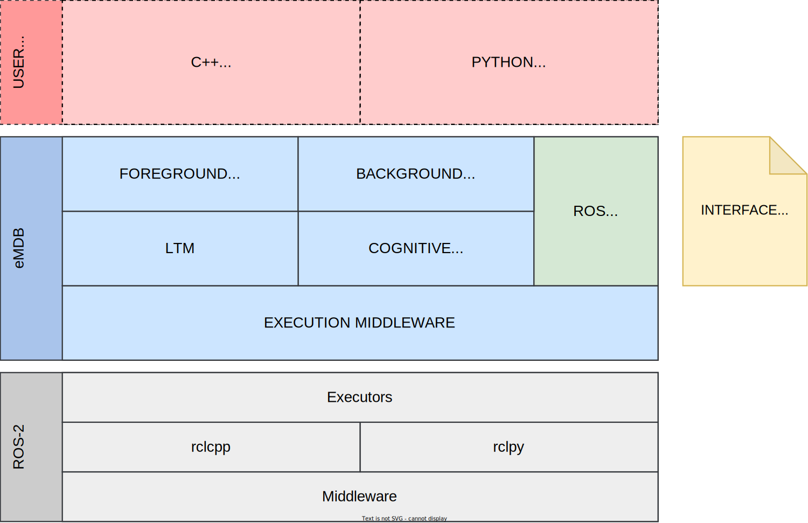
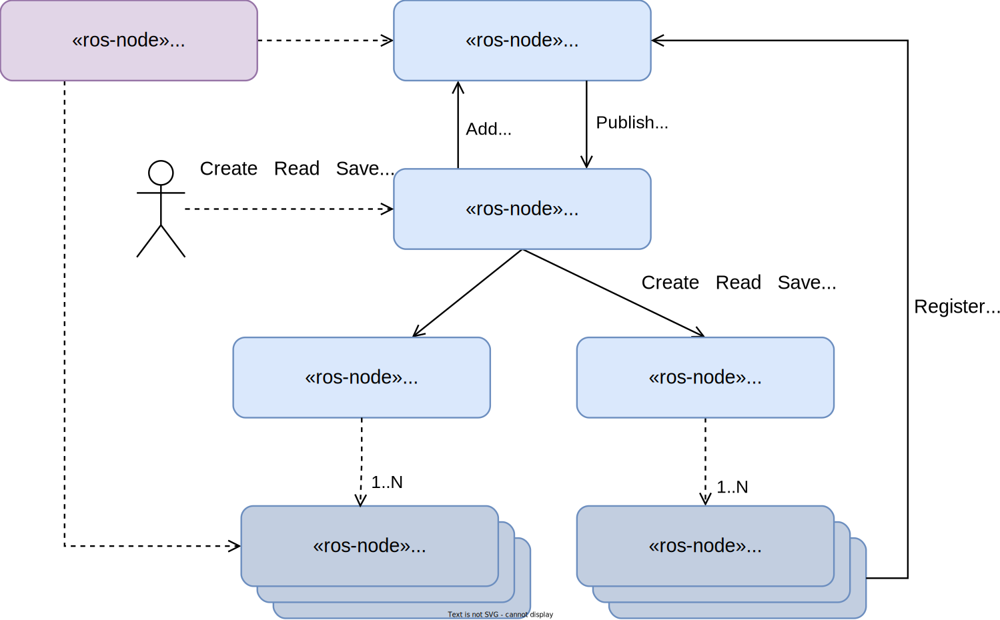

# Concepts

This section provides the main concepts related to the core elements of the cognitive architecture. It is based on the detailed design document provided in the [deliverable 5.1](https://pillar-robots.eu/deliverables/) of the PILLAR project.

## Design

A execution middleware between ROS and the cognitive architecture has been devised. The objective here is to abstract the cognitive mechanism from everything related to execution (where to run a cognitive node, how to stop it, how to create a new one, etc.). Thanks to this middleware, the cognitive architecture will be able to dynamically create, modify, replace, and delete cognitive nodes, running in a dynamic set of computers, while preserving topics and services as the only ROS concepts that the cognitive nodes are aware of.

The following figure shows the proposed software architecture. This features a simplified static view of the main software layers and how current and future developments should be organized.

*Static view of the layered architecture.*

## Components

- **Execution nodes**: They are responsible for executing the cognitive nodes in a configurable single-thread or multi-thread fashion using some load balancing strategy.
- **Commander node**: A client component cannot directly manage the execution nodes. Instead, it interacts with the Commander node façade through its ROS2 interface (services and topics). The operations can be originated by a configuration file, cognitive processes or directly by the user via CLI.
- **Long-Term Memory (LTM)**: The LTM component is responsible for keeping a record of the specific cognitive nodes that are currently available, organized by their type.
- **Cognitive node**: Consists of an abstract class, which is intended to serve as the basis for the implementation of concrete cognitive node
types.
- **Cognitive node implementations**: These are the detailed implementations of each of the different cognitive nodes. [Click here](https://docs.pillar-robots.eu/projects/emdb_cognitive_nodes_gii/en/latest/) for more details.  
- **Cognitive processes**: Implementation of particular cognitive processes, which use the cognitive nodes currently registered in the LTM. [Click here](https://docs.pillar-robots.eu/projects/emdb_cognitive_processes_gii/en/latest/) for more details. 

The following figure shows the dynamic view of the execution middleware and shows how the different components interact during runtime.

*Dynamic view illustrating the operation of the execution middleware at runtime.*

<!-- ## Topics and services

The components of the execution middleware define different topics and services as the ROS2 interface that is used to interact with them. The definition of this interface can be found in the [Core API Documentation](API.rst) section. -->
